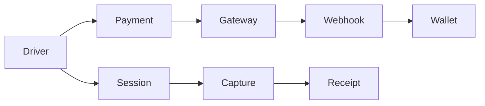

# Fluxo financeiro

Valores são **inteiros em centavos**. O backend é a autoridade. O frontend só exibe.

## Modelos (já existentes — não duplicar)

| Modelo | Função |
|---|---|
| `Wallet` | `balanceCents` do motorista |
| `WalletHold` | Reserva de saldo por sessão (`OPEN` → `CAPTURED`/`RELEASED`) |
| `WalletTransaction` | Extrato (crédito, débito, hold, release, refund) |
| `Payment` | Intenção PIX/cartão/wallet junto ao gateway |
| `PaymentAuthorization` | Pré-autorização de cartão da sessão |
| `PaymentWebhookEvent` | Evento inbound idempotente (`provider` + `externalEventId`) |
| `PaymentReconciliationCase` | Divergência financeira para o Admin |
| `ChargingSession.billingStatus` | `NONE`, `AUTHORIZED`, `CAPTURED`, `PAYMENT_FAILED`, … |
| `Receipt` | Comprovante após capture |

## Exemplo de carteira

Saldo = R$ 100,00 (`balanceCents=10000`).

Hold da sessão = R$ 50,00. O saldo **não cai** no hold; o disponível vira R$ 50,00.

Sessão termina em R$ 32,00.

- Capture: R$ 32,00 debitados
- Liberação: R$ 18,00
- Saldo final: R$ 68,00

```
10000  saldo
- 5000 hold OPEN          disponível 5000
StopTransaction custo 3200
capture 3200 + release 1800
saldo 6800
```

Idempotência de capture: `billing-capture-{sessionId}`.

## Métodos

### Carteira / PIX

PIX **recarrega a carteira**. Não cria cobrança PIX no instante do `sessions/start`. Sem saldo suficiente para o envelope, o start é bloqueado.

Fluxo PIX: Driver pede top-up → `Payment` PENDING → QR/copia-e-cola → webhook `CONFIRMED` → crédito na wallet (uma vez).

### Cartão tokenizado

Se o provider `supportsCardPreAuthorization` (Asaas sandbox): `authorizeCard` no envelope → sessão → `capturePayment` no custo real → restante liberado no gateway.

Sem preauth: fallback para hold de carteira. Não há “cobrar depois sem limite”.

### Mock

`PAYMENT_PROVIDER=mock` (padrão). Confirmação via `POST /payments/:id/simulate`. Sem chave Asaas.

### Asaas sandbox

`PAYMENT_PROVIDER=asaas` + `PAYMENT_API_KEY` + `PAYMENT_ENVIRONMENT=sandbox`. Produção Asaas só com credenciais reais suas. Até lá, **sandbox**.

## Webhook e idempotência

`POST /api/payments/webhooks/:provider`

- Assinatura / token (`PAYMENT_WEBHOOK_SECRET`) quando configurado
- `PaymentWebhookEvent` único por `provider` + `externalEventId`
- Replay não credita duas vezes

## Refund

Operador/admin informa motivo. Audit. `refundIdempotencyKey`. Não apaga a sessão.

## Reconciliação

Casos em `PaymentReconciliationCase` (valor, webhook duplicado, capture falho, etc.). Admin: `/dashboard/finance/reconciliation`.



Draw.io: [billing-flow.drawio](billing-flow.drawio)
