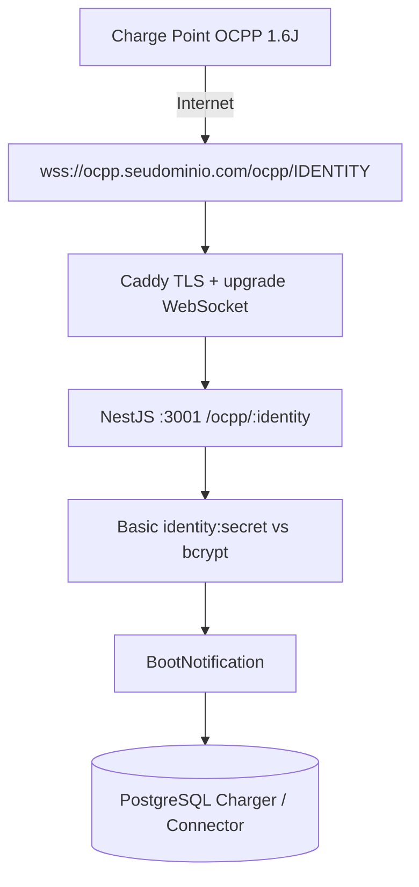

# Conexão do carregador físico



1. DNS `ocpp.seudominio.com` → VPS.
2. Caddy termina TLS e faz upgrade HTTP → WebSocket.
3. `OcppWsServer` exige path `/ocpp/{identity}`, subprotocolo `ocpp1.6` e Basic auth.
4. Identity da URL = identity cadastrada = usuário Basic.
5. Secret comparado com `ChargerCredential.credentialHash`.
6. Uma conexão viva por charger; reconectar substitui a anterior.
7. Watchdog: sem mensagem além de `OCPP_OFFLINE_THRESHOLD_MS` (180s) → OFFLINE.

Local:

```
ws://localhost:3001/ocpp/EVSE-CUIABA-001
```

Internet:

```
wss://ocpp.seudominio.com/ocpp/EVSE-CUIABA-001
```

Draw.io: [charger-connection.drawio](charger-connection.drawio)
