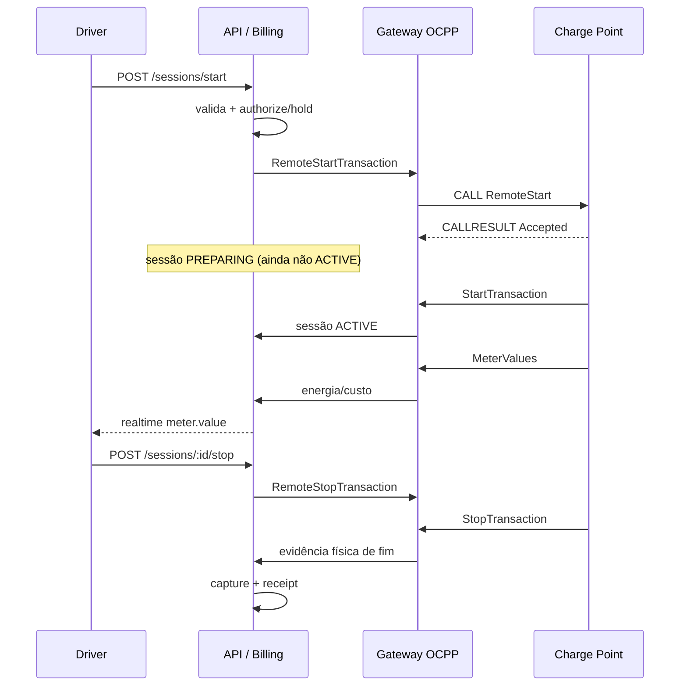

# Fluxo de recarga (motorista → bomba física)

O frontend **não** declara que a recarga começou. Quem prova o início físico é `StartTransaction`. Quem prova o fim físico é `StopTransaction`. O billing só captura depois disso.

## Passo a passo

1. Operador cadastra a **estação**.
2. Operador cadastra o **charger** com `identity` única (ex.: `EVSE-CUIABA-001`) e `providerId=ocpp16`.
3. Operador gera a **credencial** (Admin → carregador → Gerar credencial OCPP). O secret aparece **uma vez**.
4. Técnico configura o equipamento: URL WSS, identity, usuário/senha, protocolo OCPP 1.6J.
5. O carregador abre WebSocket em `wss://ocpp.seudominio.com/ocpp/{identity}` com Basic auth e subprotocolo `ocpp1.6`.
6. A API autentica contra `ChargerCredential.credentialHash` (bcrypt). Identity da URL deve bater com o usuário Basic.
7. Charge Point envia `BootNotification` → CSMS responde `Accepted`.
8. Charge Point envia `StatusNotification` → connector/charger atualizam no banco.
9. Driver vê disponibilidade no mapa/lista.
10. Driver pede início (conector + veículo + método de pagamento).
11. Backend valida usuário, veículo, connector, tarifa vigente (snapshot) e pagamento/saldo.
12. `SessionBillingService` **autoriza** (hold de carteira ou pré-autorização de cartão) **antes** do RemoteStart.
13. Sessão fica `PENDING`/`PREPARING`. Ainda **não** é `ACTIVE`.
14. Backend envia `RemoteStartTransaction` (idTag da plataforma).
15. Carregador aceita (`Accepted`) e inicia o hardware.
16. Carregador envia `StartTransaction` → sessão vai para `ACTIVE`. Esta é a evidência física de início.
17. `MeterValues` atualizam kWh, potência e custo estimado. Com hold aberto **não** há débito incremental.
18. Driver vê telemetria via `/realtime`.
19. Driver pede parada (ou o veículo termina). Backend envia `RemoteStopTransaction`.
20. Carregador para o hardware e envia `StopTransaction`.
21. Backend trata `StopTransaction` como evidência física de encerramento.
22. Billing captura o custo final, libera o restante do hold, gera `Receipt`.
23. Connector volta para `AVAILABLE` (via `StatusNotification`).

Draw.io: [charging-flow.drawio](charging-flow.drawio)
