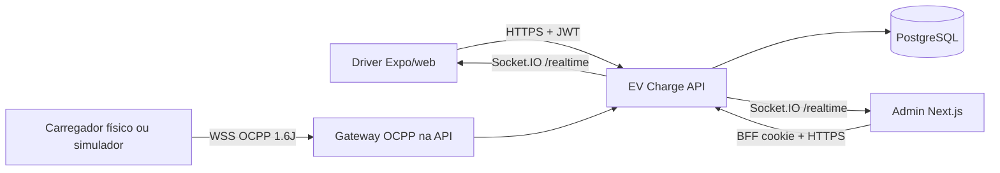

# Arquitetura geral

O EV Charge é um monorepo: **Driver**, **Admin** e **API**. A API é também o **CSMS** OCPP 1.6J. O banco é PostgreSQL via Prisma 6.

## Visão

| Bloco | Papel |
|---|---|
| Driver | Motorista: mapa, reserva, carteira, iniciar/parar recarga |
| Admin | Operação, estações, OCPP, financeiro, incidentes |
| API | Autenticação, RBAC, sessões, billing, webhooks |
| OCPP Gateway | WebSocket `/ocpp/{identity}` no mesmo processo da API |
| PostgreSQL | Fonte da verdade (sessão, pagamento, charger, auditoria) |
| Carregador | Charge Point OCPP 1.6J (físico) ou simulador |

Socket.IO `/realtime` **não** é o canal OCPP. O frontend nunca fala com o carregador.

Arquivo Draw.io: [overview.drawio](overview.drawio)
