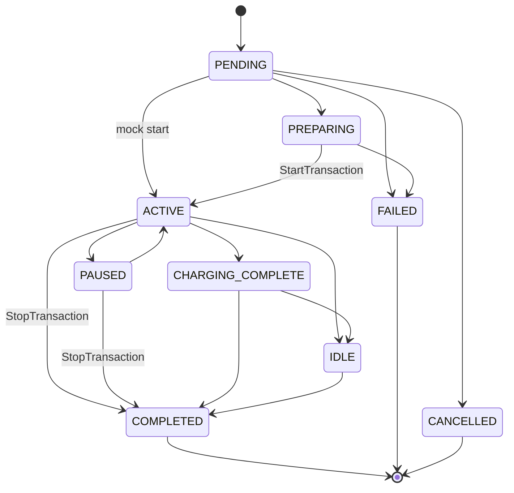

# Ciclo de vida da sessão

Estados em `ChargingSession.status` (Prisma `SessionStatus` + domínio `packages/domain/src/state/session-status.ts`).

O **app não é autoridade**. Ele só pede. O backend muda estado com evidência do provider (OCPP ou mock).

## Quem muda o quê

| Estado | Quem entra | Evidência | Quem sai |
|---|---|---|---|
| `PENDING` | API, após start aceito (pagamento autorizado, RemoteStart ainda não confirmado pelo hardware) | Pedido HTTP do driver + authorize | API |
| `PREPARING` | API / StatusNotification `Preparing` | Carregador preparando | API + OCPP |
| `ACTIVE` | **StartTransaction** (OCPP) ou start imediato no **mock** | Transação física iniciada | OCPP inbound / MockChargerProvider |
| `PAUSED` | Pause do driver mapeado para Suspended no connector | Pedido + provider | API |
| `CHARGING_COMPLETE` | Energia concluída, cabo ainda conectado | Meter/status OCPP | OCPP inbound |
| `IDLE` | Veículo conectado sem carregar (idle fee) | Status OCPP / watchdog | API |
| `COMPLETED` | **StopTransaction** (OCPP) ou stop mock equivalente | Evidência física de fim | OCPP inbound; depois billing |
| `FAILED` | Falha de comunicação, rejeição, falta, timeout operacional | Eventos OCPP / watchdog | API |
| `CANCELLED` | Cancelamento antes de ACTIVE | Pedido ou expiração | API |

Transições permitidas (domínio):

- `PENDING` → `PREPARING` \| `ACTIVE` \| `FAILED` \| `CANCELLED`
- `PREPARING` → `ACTIVE` \| `FAILED` \| `CANCELLED`
- `ACTIVE` → `PAUSED` \| `CHARGING_COMPLETE` \| `IDLE` \| `COMPLETED` \| `FAILED` \| `CANCELLED`
- `PAUSED` → `ACTIVE` \| `CHARGING_COMPLETE` \| `COMPLETED` \| `FAILED` \| `CANCELLED`
- `CHARGING_COMPLETE` → `IDLE` \| `COMPLETED` \| `FAILED` \| `CANCELLED`
- `IDLE` → `COMPLETED` \| `FAILED` \| `CANCELLED`
- Terminais: `COMPLETED`, `FAILED`, `CANCELLED`

## ACTIVE

No OCPP, `POST /sessions/start` **não** coloca `ACTIVE`.

Fluxo:

1. Validações + hold/pré-autorização.
2. `RemoteStartTransaction`.
3. Sessão `PENDING`/`PREPARING`.
4. Charge Point envia `StartTransaction`.
5. Backend grava `OcppTransaction` e promove a sessão para `ACTIVE`.

No mock (`CHARGER_PROVIDER_TYPE=mock` e charger `providerId=mock`), o start interno pode ir a `ACTIVE` sem OCPP — só no ambiente demo.

## Encerramento financeiro

`POST /sessions/:id/stop` envia `RemoteStopTransaction` e marca intenção de parada (`remoteStopPending`). **Não** captura pagamento.

A captura, o débito e o recibo acontecem quando chega `StopTransaction` (ou o equivalente mock). Se o pagamento final falhar, a sessão física pode ficar `COMPLETED` com `billingStatus=PAYMENT_FAILED` — ver [billing-flow.md](billing-flow.md).

